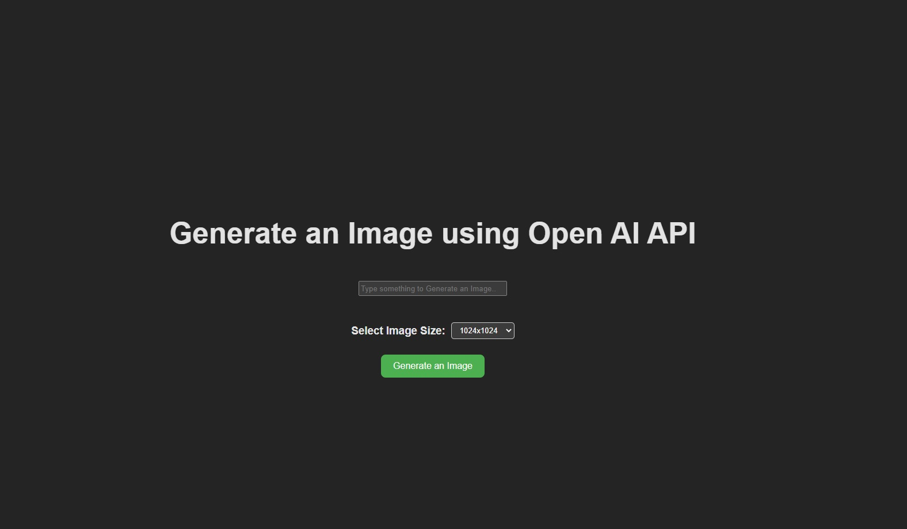

# Generate Image using OpenAI API

# Generate Image using OpenAI API

This project uses the OpenAI API to generate images from a prompt string. The user can select the image size and generate the image.

## Features

- Generate image from a prompt string
- Select the image size

## Used Technologies

- ReactJS
- OpenAI API

## How to use

1. [Click here to acess](https://devsbruno.github.io/Dall-E-Clone/)
1. Type something to generate an Image
1. Select Image Size
1. Click in Generate an Image
